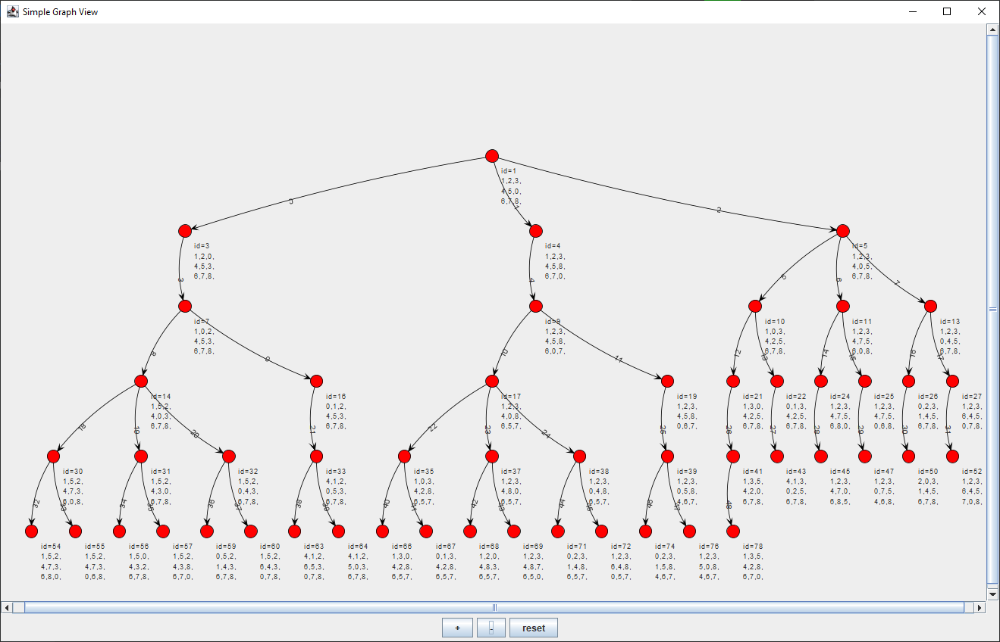
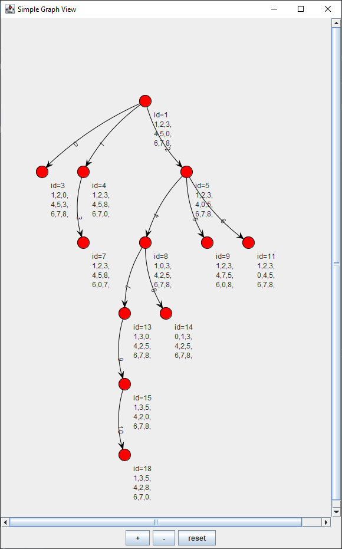

# Search Algorithms

Use of different informed and uninformed search algorithms to solve the NinePuzzle problem and visualization of the path chosen by the different search algorithms.


### Puzzle with the best solution of 5 movements
```
NinePuzzle start = new NinePuzzle(new int[]{1, 2, 3, 4, 5, 0, 6, 7, 8});
NinePuzzle goal = new NinePuzzle(new int[]{1, 3, 5, 4, 2, 8, 6, 7, 0});
```
### Puzzle with the best solution of 31 movements
```
NinePuzzle start = new NinePuzzle(new int[]{8, 6, 7, 2, 5, 4, 3, 0, 1});
NinePuzzle goal = new NinePuzzle(new int[]{1, 2, 3, 4, 5, 6, 7, 8, 0});
```

        
### Uninformed search algorithms
```
new AlgorismesNoInformats().BFS(start,goal);
new AlgorismesNoInformats().DFS(start,goal);
```

### Informed search algorithms
```
new AlgorismesInformats().HillClimbing(start,goal);
new AlgorismesInformats().BestFirst(start,goal);
new AlgorismesInformats().N_Profunditat(start, goal, 5);
new AlgorismesInformats().A(start, goal);
```

### Examples

#### BFS


#### A
